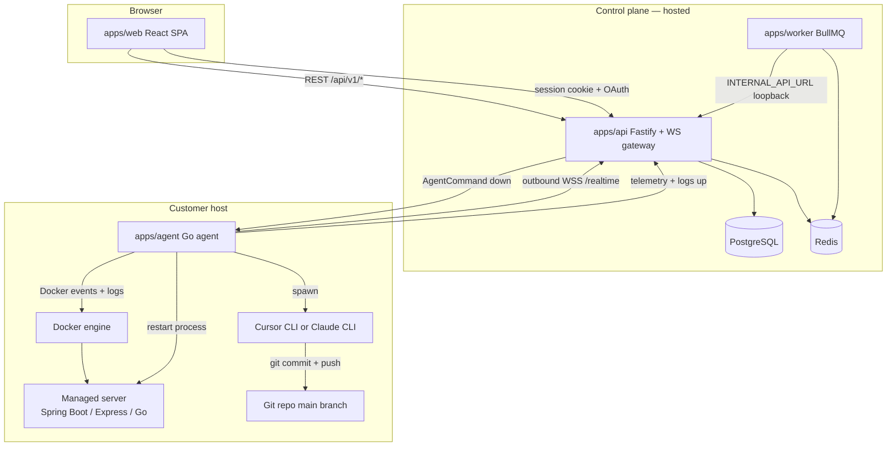
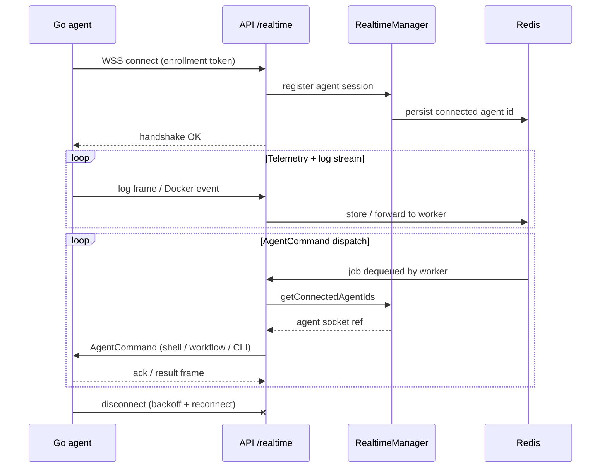
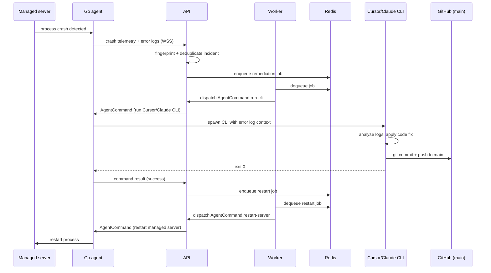
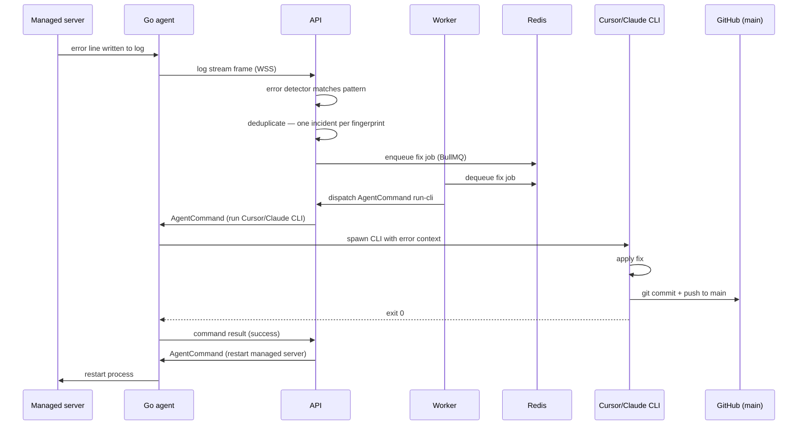
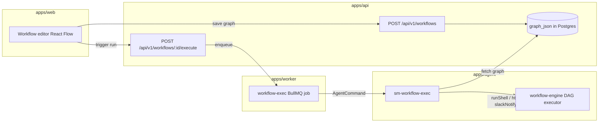
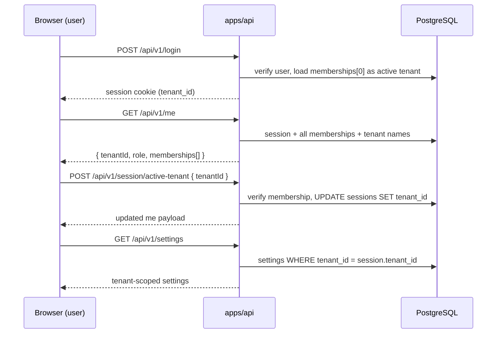

# Agent instructions

All behavior for coding in this repository is governed by **`.cursor/rules/*.mdc`**. Those files are **binding** on every prompt, not optional guidance.

- Start with **`meta-all-rules-binding.mdc`** (always applies).
- Follow skills in **`.cursor/skills/`** when their description matches your task.

User-defined Cursor **User Rules** take precedence if anything conflicts.

## Project definition

### Summary

**Kaiad** is a multi-tenant SaaS control plane and runtime agent system for automated server lifecycle management. It monitors running services (Spring Boot, Express.js, Go servers), detects crashes and error-log events, and uses AI coding agents (Cursor CLI or Claude CLI) to automatically diagnose the cause, apply a code fix, commit to `main`, and restart the affected server — all without human intervention.

Two recovery flows:

1. **Crash recovery** — when a managed server process crashes, a Cursor or Claude CLI session is started against the error logs, a fix is produced and committed to `main`, and the agent restarts the server.
2. **Error-log fix** — when a non-fatal error is written to logs, a fix job is queued via Redis/BullMQ. The same CLI agent picks it up, commits a fix to `main`, and the workflow restarts the process.

Both flows close the loop by instructing the agent that owns the server process to restart it.

### Description

Kaiad is a **multi-tenant control plane** with a customer-managed **outbound Go agent**. Tenants install the Go agent on their own infrastructure; the agent connects outbound over WSS (TLS WebSocket) to the hosted control plane. The control plane sends `AgentCommand` messages down that channel — shell execution, workflow steps, GitHub operations, and CLI-agent invocations — and receives telemetry and log streams back up.

Key platform capabilities:

- **Service monitoring** — tenants register services; the agent streams Docker container logs and lifecycle events to the control plane.
- **Incident deduplication** — the API fingerprints incoming errors and deduplicates incidents so repeated log noise produces one remediation job.
- **Workflow engine** — a React Flow-based graph editor lets tenants define automation workflows (triggers, shell commands, HTTP requests, Slack notifications, branch conditions). Workflows are stored as graph JSON and executed by the agent via `sm-workflow-exec`.
- **AI-assisted remediation** — worker jobs enqueue Cursor CLI or Claude CLI runs on the agent's host; the runner applies fixes, commits to `main`, and the workflow restarts the server.
- **GitHub App integration** — the control plane can clone repos, open PRs, push branches, and trigger GitHub Actions workflow dispatches under tenant policy (allowlisted repos, branches, and actions; fully audited).
- **Multi-tenant session model** — users belong to one or more tenants with RBAC roles (owner, admin, viewer). Session tenant is switchable via `/session/active-tenant`; all settings and agent data are tenant-scoped.
- **First-run setup wizard** — a guided web UI configures Postgres, Redis, the first admin account, GitHub App credentials, optional OAuth (Google), and optional Kubernetes metadata; persisted to `kaiad.config.json` with environment variable precedence.
- **Single-port deployment** — the React SPA, Fastify API, WebSockets, and optionally the BullMQ worker all serve from one HTTP port, simplifying Docker and Kubernetes deployments.

### Apps

#### `apps/web` — React/Vite admin SPA (port 4173 in dev)

- **Authentication** — login page, OAuth (Google), session management via `useAuth`.
- **Dashboard** — live summary of services, incidents, and connected agents.
- **Services page** — list and manage monitored services per tenant.
- **Connected Agents page** — table of enrolled agents with live WebSocket presence (`websocketConnected`), status, version, capabilities, and linked service count.
- **Tenants page** — list tenant memberships with role; gear icon opens per-tenant configuration (Automation Policy, Executors, kill switch).
- **Workflow editor** — React Flow canvas for building, saving, and running automation graphs (node types: trigger, runShell, httpRequest, slackNotify, branchIf, etc.).
- **Settings page** — authentication providers (OAuth), enrollment tokens, GitHub App credentials (App ID, PEM, webhook secret).
- **Setup wizard** — first-run multi-step wizard (infra, admin, GitHub App, optional OAuth, optional webhook tenant, optional Kubernetes metadata).
- **Design system** — Control Slate tokens, Lucide icons, semantic CSS/Tailwind, role-aware information architecture.

#### `apps/api` — Fastify HTTP API + WebSocket gateway (port 3001)

- **REST API** (`/api/v1/*`) — CRUD for tenants, services, agents, incidents, enrollment tokens, workflows, settings, GitHub App config, and setup wizard routes.
- **Realtime gateway** (`/realtime` WebSocket) — bidirectional channel for the Go agent: receives telemetry and log frames up; pushes `AgentCommand` messages down. Managed by `RealtimeManager`.
- **Auth** — session cookies, Postgres-backed auth store after setup (memory store in dev/tests), OAuth callback handler, RBAC middleware.
- **Setup routes** — minimal bootstrap surface before setup completes (`/api/v1/setup/*`); full routes promoted via hot reload after wizard finishes.
- **Config persistence** — reads/writes `kaiad.config.json` in `KAIAD_DATA_DIR`; merges into `process.env` at startup; env vars always win over file.
- **Static serving** — serves the built React SPA from `dist/public/` so the whole app runs on one port in production.
- **Embedded worker mode** — when `SM_EMBED_WORKER=1`, starts BullMQ workers in-process instead of requiring a separate worker container.
- **GitHub webhook ingress** — receives and validates GitHub App webhooks; routes to the default webhook tenant.

#### `apps/worker` — BullMQ background worker (health port 9090)

- **Remediation jobs** — dequeue error/incident jobs and dispatch Cursor CLI or Claude CLI commands to the connected agent.
- **GitHub jobs** — clone, PR, push, workflow dispatch under tenant GitHub App installation tokens.
- **Workflow execution jobs** — enqueue `sm-workflow-exec` shell commands on the agent.
- **Health server** — lightweight HTTP on port 9090 (`/health`) for independent probing in multi-container deployments.
- **Standalone or embedded** — runs as its own process in the default Compose stack; can be embedded in `apps/api` via `SM_EMBED_WORKER=1` for single-container deployments.

#### `apps/agent` — Go outbound runtime agent

- **Outbound WebSocket connection** — connects to the control plane's `/realtime` endpoint using an enrollment token; maintains a persistent, backpressure-aware channel with exponential reconnect backoff.
- **Docker lifecycle monitoring** — watches Docker container start/stop/crash events and streams logs to the control plane.
- **Command execution** — receives `AgentCommand` frames and dispatches: shell commands, workflow executor (`sm-workflow-exec`), Cursor CLI or Claude CLI runner invocations.
- **AI-agent runner** — launches Cursor or Claude CLI in an isolated job context with the error log as input; captures the fix, commits to `main`, then signals the control plane to restart the server.
- **Credential persistence** — supports file-backed enrollment credentials (`SM_AGENT_PERSIST_CREDENTIALS=1`); production requires explicit `SM_ENROLLMENT_TOKEN`.
- **Enrollment** — registers with the control plane on first connect; token lifecycle is Postgres-durable (no in-memory-only tokens in production).

### Shared packages (`packages/`)

| Package | Purpose |
|---------|---------|
| `contracts` | Zod schemas for HTTP request/response, WebSocket frames, BullMQ job payloads, and OpenAPI output. Single source of truth across api, worker, web, and agent. |
| `domain` | Business logic types and validation (workflow graph, service, incident rules). |
| `db` | Drizzle ORM schema (`tenants`, `users`, `sessions`, `tenant_memberships`, `monitored_services`, `agents`, `incidents`, `workflow_graphs`, etc.) and query helpers. |
| `queue` | BullMQ queue definitions, job payload types, and shared Redis client factory. |
| `workflow-engine` | DAG executor for workflow graphs: parallel branches, join nodes, conditional branching, step result tracking. |

### Tech stack

- **Tooling:** pnpm workspaces, Turborepo, TypeScript throughout.
- **API:** Fastify (locked for v1).
- **Realtime:** WSS (TLS WebSocket) — gRPC is deferred post-MVP.
- **Agent language:** Go (locked for v1).
- **Database:** PostgreSQL (Drizzle ORM).
- **Queue:** Redis + BullMQ.
- **Frontend:** React 18, Vite, React Flow, Tailwind CSS, Lucide icons.
- **Testing:** Vitest (TS), Go cover (agent), Testcontainers (integration), Playwright E2E (IDs E2E-001–006), black-box acceptance tests (AT-*) on every PR and push to `main`.
- **Deployment:** Docker Compose (multi-service or unified single-port); Kubernetes.

For ports, Compose files, and env var tables see [`README.md`](README.md).

### Environments and URLs

- **Kaiad Panel (Dev):** https://panel.dev.kaiad.dev/
- **Kaiad Panel (Prod):** https://panel.kaiad.dev/

### Development Credentials

- **Email:** `test@example.com`
- **Password:** `mypassword123`

### Ports Configuration

- **App (Dev):** 8092
- **App (Prod):** 8091
- **Postgres (Dev):** 5001
- **Postgres (Prod):** 5002
- **Redis (Dev):** 6001
- **Redis (Prod):** 6002

### Architecture flows

#### Overall system topology

#### Agent connection lifecycle

#### Crash recovery flow

#### Error-log fix flow (non-fatal)

#### Workflow execution flow

#### Multi-tenant session and settings scope

### Non-negotiables

1. **Contracts are the source of truth** — all HTTP, WebSocket, and job payload shapes live in `packages/contracts`. Never diverge api, worker, web, or agent types from contracts without updating contracts first.
2. **Coverage gate** — CI fails if merged line coverage drops below 80% for any TypeScript package or app; Go agent must also pass `go cover`.
3. **No in-memory auth in production** — `createMemoryAuthStore` is for dev and tests only. Postgres auth store is required when `DATABASE_URL` is set.
4. **Env wins over config file** — environment variables always override `kaiad.config.json`. Do not reverse this precedence.

## Always (every prompt)

1. Follow **Cursor → Settings → Rules → User Rules** on every turn.
2. Follow **`.cursor/rules/*.mdc`** here. Files with **`alwaysApply: true`** apply every turn; **glob-scoped** rules apply when you touch matching paths.

## Before every response (checklist)

1. **Always:** Apply **User Rules** in full on this turn.
2. **Always:** For substantive work, **list or read** **`.cursor/rules/*.mdc`** so nothing is missed (including glob rules for files you edit).
3. **If** a skill under **`.cursor/skills/`** matches the task, **read and follow** it first.
4. **If** you **`git push`** or updated **`origin`**: You are **not** done until you **monitor GitHub Actions** for that commit (see **`post-push-github-actions-monitor.mdc`**) and report workflow outcomes.
5. **If** you change **`apps/`** or **`packages/`** (or configs that affect build): Run **build + tests** for the impacted scope before claiming done (see **`verification-before-stopping-code-changes.mdc`**).
6. **If** you make functional changes (especially UI, API, or workflow): Verify them using the dev panel at **http://panel.dev.kaiad.dev** before claiming the work is complete (see **`ui-verification-gate.mdc`**).
7. **If** you cannot run a required step: Say so **explicitly**; do not imply green CI or full compliance.

## Multi-root workspaces

If your Cursor workspace root is a **parent folder** that contains this repo (e.g. home + `service-monitor/`): also follow **`AGENTS.md`** and **`.cursorrules`** at that workspace root when present.
