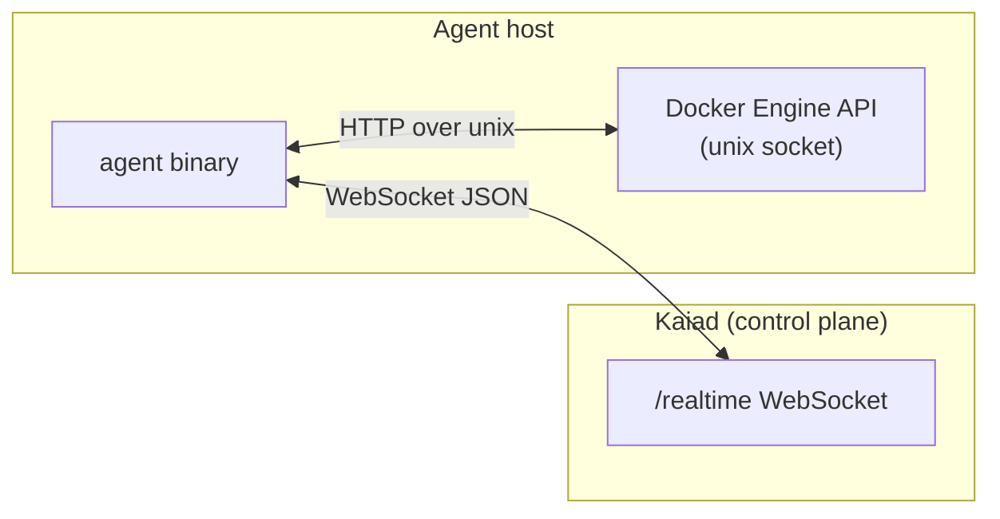
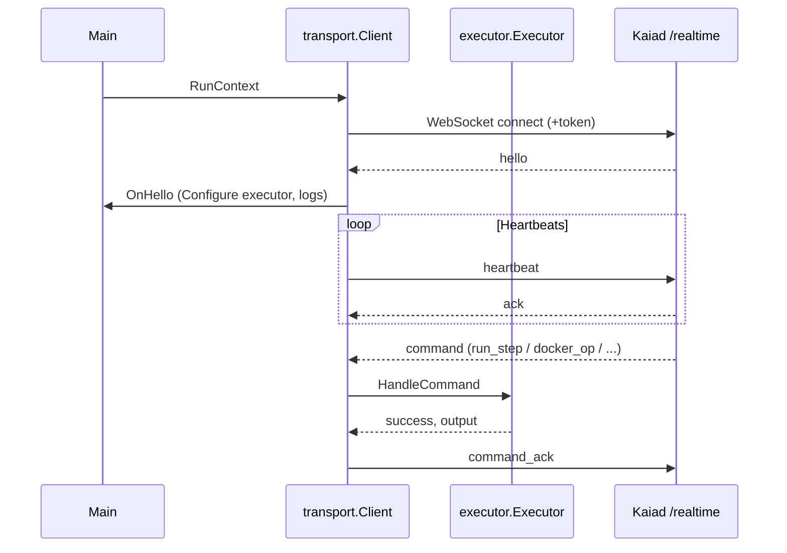

# Kaiad Agent — Architecture

This document describes the **Go runtime agent** (`github.com/service-monitor/agent`): how it fits into Kaiad, its internal packages, and the control/data flows between the agent, Docker, and the Kaiad realtime API.

For runbooks, env vars, and CI coverage expectations, see [README.md](README.md). Product-level context lives in [../../README.md](../../README.md).

## Role in the system

The agent is an **outbound WebSocket client**. It connects to Kaiad’s `/realtime` endpoint, sends heartbeats and log events, and **executes remote commands** (shell steps, Docker operations, desired-state sync stubs, and plan runners). It does not expose an inbound HTTP server for the control plane; all control traffic is initiated by maintaining the WebSocket session.

## Module layout

| Path | Responsibility |
|------|----------------|
| [`cmd/agent/main.go`](cmd/agent/main.go) | Process entry: env, credentials, Docker client, transport client, hello callback, log streaming bootstrap |
| [`internal/transport`](internal/transport) | WebSocket client: dial, session loop, heartbeats, inbound message dispatch, `command_ack`, exponential backoff reconnect |
| [`internal/executor`](internal/executor) | Implements `transport.CommandHandler`: command routing, shell/Docker/plan execution |
| [`internal/docker`](internal/docker) | Minimal Docker Engine HTTP API over the unix socket; container list/start/stop; log stream attachment |
| [`internal/credentials`](internal/credentials) | Optional on-disk enrollment persistence (`SM_AGENT_PERSIST_CREDENTIALS`) |

Shared **message shapes** for realtime traffic are defined in TypeScript/Zod in [`packages/contracts/src/realtime.ts`](../../packages/contracts/src/realtime.ts); the Go types mirror the JSON payloads (see `AgentHello` in `transport`).

## Control flow: process startup

1. **Configuration** — Read `SM_REALTIME_URL` (default `ws://localhost:3001/realtime`), `SM_AGENT_ID`, `SM_ENROLLMENT_TOKEN`, Docker socket `SM_DOCKER_SOCKET`. Optionally load persisted credentials when `SM_AGENT_PERSIST_CREDENTIALS=1`.
2. **Production gate** — If `NODE_ENV=production` and there is no token and no persisted credential path in use, the process exits.
3. **Clients** — Construct `docker.Client`, `executor.Executor`, then `transport.NewClient` with `WithCommandHandler(exec)` and `OnHello(...)`.
4. **Run loop** — `client.RunContext(ctx)` owns the process lifetime: connect, handle session, reconnect with backoff on failure.

## Transport layer (`internal/transport`)

### Connection and resilience

- **Dial URL** — Base WebSocket URL; if `SM_ENROLLMENT_TOKEN` is set, it is appended as a `token` query parameter (see `dialURL`).
- **Sessions** — Each successful dial runs `runSession`: stores the active connection, starts a **read goroutine**, and runs a **heartbeat ticker** (default 10s, configurable via `WithHeartbeatInterval`).
- **Reconnect** — On dial failure or session end, the client sleeps using **exponential backoff with jitter** (`internal/transport/backoff.go`, bounded by min/max durations), then redials. `CloseActiveForReconnect` closes the active socket so the outer loop reconnects and receives a fresh `hello` (used when Kaiad tenant config may have changed).

### Inbound messages

The read loop unmarshals a small envelope (`type`, `commandId`), then:

| `type` | Behavior |
|--------|----------|
| `hello` | Parsed as `AgentHello`; `onHello` runs (main wires executor configuration and optional log streaming). |
| `heartbeat_ack` / `ack` | Triggers `onFirstAck` once (e.g. persist credentials after first successful server acknowledgment). |
| `run_step`, `docker_op`, `cancel_run`, `sync_desired_state`, `run_cursor_plan`, `run_claude_plan` | Deduplicated by `commandId`, then handled asynchronously via `CommandHandler`; result sent as `command_ack`. |

Unknown or malformed messages are ignored or dropped safely; duplicate `commandId`s are ignored after the first execution.

### Outbound messages

- **Heartbeat** — JSON with `type: heartbeat`, agent id, timestamp, capacity, optional tenant/version fields.
- **Log events** — `SendLogEvent` implements `docker.LogSender`; used by `StreamContainerLogs` to forward container log lines as `log_event` messages.
- **Command completion** — `command_ack` with status `completed` or `failed` and textual output.

## Executor (`internal/executor`)

The executor is the **single implementation** of `transport.CommandHandler`. It holds:

- Selected **runtime backend** from the last `hello`: `docker`, `kubernetes`, or `shell`.

### Command types (summary)

| Command | Purpose |
|---------|---------|
| `run_step` | Run `sh -c` with the provided shell string. |
| `run_toolchain` | Run a script or binary with a named host toolchain (`language` + `path` + optional `args`, `cwd`, `env`). Supports `python3`, `java` (`.jar` only via `java -jar`), `node`, `go` (`go run` for `.go`, else execute path), `php`, `typescript` (default `npx --yes tsx`, override `SM_TYPESCRIPT_RUNNER`), `rust` (`.rs` compiled with `rustc` then executed), `swift`, `kotlin` (default `kotlin`, override `SM_KOTLIN_RUNNER`). Requires the tools on the agent `PATH`. |
| `docker_op` | Dispatch by `operation` and `args` (e.g. start/stop container, `docker`/`docker-compose` CLI wrappers). Behavior depends on `RuntimeBackend`. |
| `sync_desired_state` | Validates `desiredContainers` array; stub success message with entry count. |
| `run_cursor_plan` / `run_claude_plan` | Invoke Cursor or Claude CLI (or isolated Docker runner) with prompt and workspace; artifacts under `<workspace>/.sm/logs/`. |

Plan execution supports optional **container isolation** (`SM_EXECUTOR_ISOLATE_CONTAINERS`) with runner images and timeouts via env (see README).

## Docker integration (`internal/docker`)

- **Client** — Unix socket HTTP to Docker Engine (`/var/run/docker.sock` by default). Used for listing containers, start/stop, and log streaming.
- **Log streaming** — `StreamContainerLogs` reads the attach stream line-by-line, classifies a coarse log level, and sends events through `LogSender` (the transport client).

Log streaming of **existing** containers is started once after `hello` when the runtime backend is **docker**, unless `SM_ENABLE_LOG_STREAMING=0`.

## Hello message and runtime selection

After connect, Kaiad sends `type: "hello"` with tenant agent settings. The Go struct `AgentHello` aligns with `agentHelloMessageSchema` in contracts.

It then calls `executor.Configure` with:

- `nil` docker client for shell-only mode, or the real client for docker mode.
- The resolved `RuntimeBackend` enum.

## Credentials (`internal/credentials`)

- **Default:** stateless — token and URL come from the environment each run.
- **Optional persistence:** when `SM_AGENT_PERSIST_CREDENTIALS=1`, JSON is read/written at `SM_CREDENTIAL_PATH` or `~/.service-monitor/agent-credential.json`. After the first successful `ack`, main may save enrollment material if persistence is enabled and the agent enrolled with a token.

## Dependencies

- **Go 1.22** — see [`go.mod`](go.mod).
- **github.com/gorilla/websocket** — WebSocket client.
- Docker access is via **stdlib `net/http`** over the unix socket, not the official Docker SDK.

## Testing strategy

Packages include unit tests (`executor`, `transport`, `docker`, `credentials`) and protocol/e2e-style tests where applicable. CI enforces a **minimum line coverage** threshold on this module (see README and `.github/workflows/ci.yml`).

## Diagram: session and command handling

---

When changing wire formats, update **`packages/contracts`** and keep the Go unmarshaling paths in `transport` and behavior in `executor` consistent with the API server’s `/realtime` implementation under `apps/api`.
